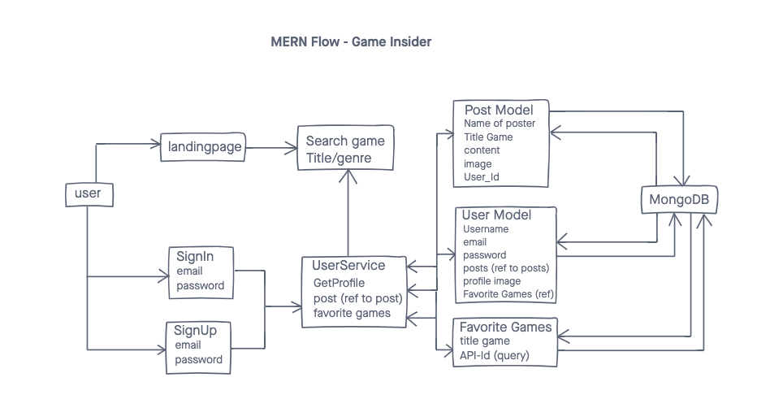
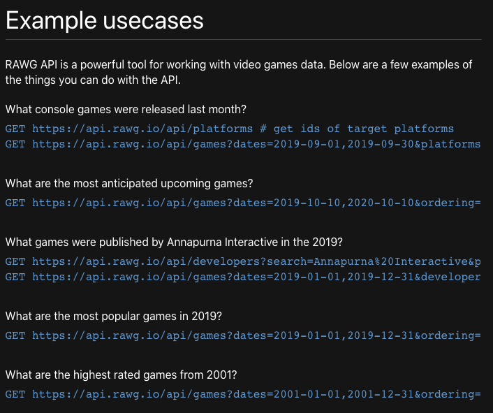

# Game Insider

Date: November 10, 2020

By: Lisa Venneker Wand

[GitHub](https://github.com/LisaKVW) |
[LinkedIn](https://www.linkedin.com/in/lisa-venneker-wand-8413ab25/) 

## Description
Site to find video games by their titles and genres.
Signed-in users, can share posts, and track their favorite games.

## Technologies used

## Getting Started
Use this app for more information about your favorite video game, or to know more more about upcoming games! 
Also, feel like talking games, share and post!

## User Stories
1. As a user I can search a game by its title.
2. As a user I can search games by genre.
3. As a user I can sign-up/sign-in, go to my account and save and find my favorite games.
4. As a user I can place posts about games.

## Wireframe

## Screenshots
To follow ones app is done.

## Code snippet
Code Snippet of API

## Credits
- Data on video games: https://rawg.io/apidocs
