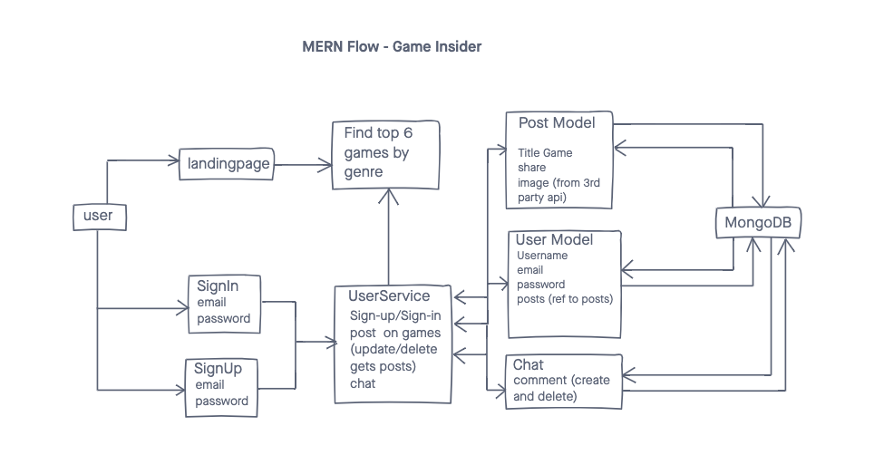

# Game Insider

Date: November 10, 2020

By: Lisa Venneker Wand

[GitHub](https://github.com/LisaKVW) |
[LinkedIn](https://www.linkedin.com/in/lisa-venneker-wand-8413ab25/) 

## Description
Site to find the top 6 video games by genre.
Signed-in users, can share, update and delete posts and feel free to share your mind in chat!

## Technologies used

## Getting Started
Sign-up and sign-in and browse game and post/update/delete as you like.
Don't feel like signing-up, you can still browse the games and review the information

## User Stories
1. As a user I can search games by genre.
2. As a user I can sign-up/sign-in, browse games by genre, and post on the ones I want.
3. As a user I can chat with other users.

## Wireframe

## Screenshots
To follow ones app is done.

## Code snippet
Code Snippet of API

## Future Updates
- Make search function for game by title.
- Add user name to posts.

## Credits
- Data on video games: https://rawg.io/apidocs
- Image Space Invaders: https://www.pexels.com/